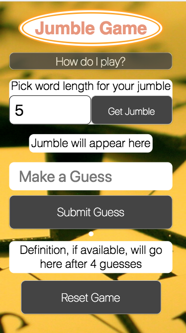
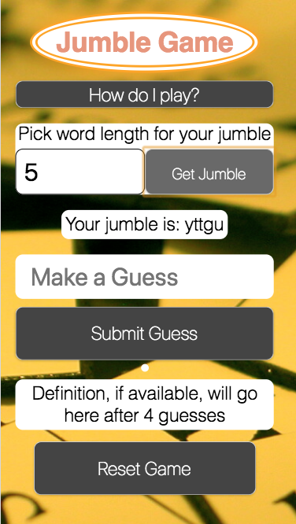
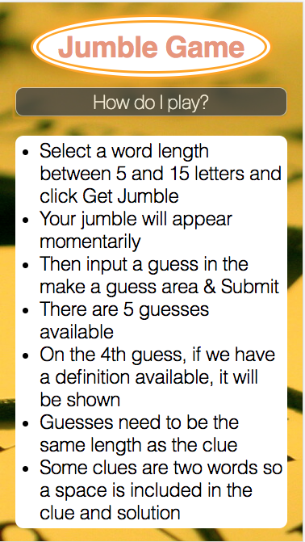
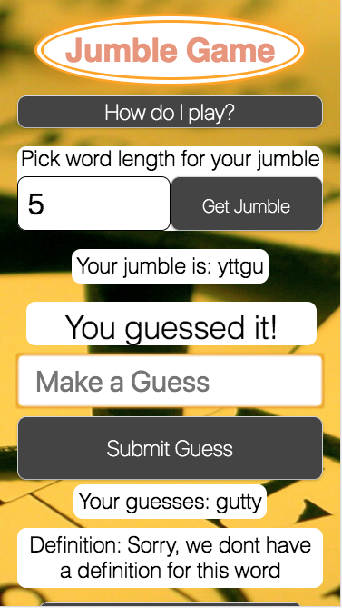

# Simple Jquery Jumble App

Site can be found at:  https://josephhess.github.io/jquery-jumble-app/

### App Summary:
  A simple jquery app that pulls in a random word, jumbles it and gives the user a number of guesses to win the game according to the instructions below.

### Instructions:

  1. Select a word length between 5 and 15 letters and click submit
  2. Your jumble will appear momentarily
  3. Then input a guess in the make a guess area
  4. There are 5 guesses available
  5. On the 4th guess, if we have a definition available, it will be shown
  6. Guesses need to be the same length as the clue
  7. Some clues are two words so a space is included in the clue and solution

### Stack:
  Html, CSS, Javascript, Jquery, WordApi

### Potential Todos:
  1. Change to a different api, the wordapi is inconsistent in what is returned
  2. If available in new api, on third guess show user the part of speech (verb, noun, etc.) and then the definition on the fourth.

### Screenshots:

